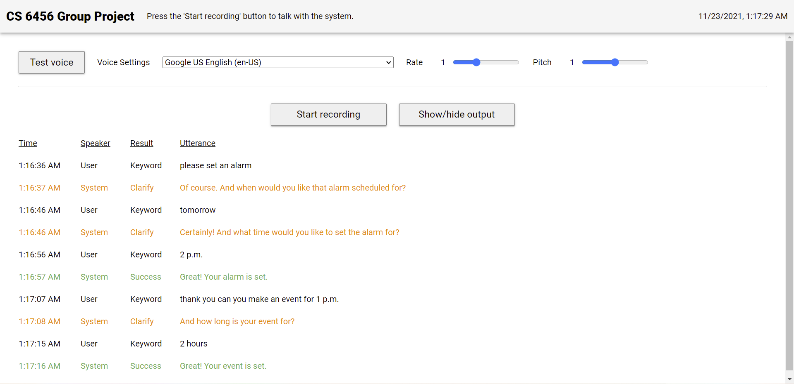

# Conversational Voice User Interface (VUI)



A conversational voice user interface for the web. Set alarms and calendar events with only your voice!

## Live Demo

Test out the system here: <https://adamcoscia.github.io/sections/projects/Conversational-VUI/index.html>

**NOTE**: The `SpeechRecognition` interface of the Web Speech API only works on
Chrome, Edge, and Safari browsers. Please open the link above using one of these
browsers.

## Setup

The `SpeechRecognition` interface requires an active internet connection to use
the tool locally.

All you need to run the tool is a local HTTP server, e.g., the one that comes
with the [`http.server`](https://docs.python.org/3/library/http.server.html)
module for [`Python 3`](https://www.python.org/).

Simply start the server rooted in the `/frontend` folder. For example, if using
`Python 3`, then from the command line or terminal navigate to the folder
containing `index.html` (e.g., `cd <path>/<to>/frontend`) and run
`python -m http.server 8000`.

Then open your browser, type `localhost:8000` into the URL address bar, and
you should see the application!

## JavaScript Resources

The tool is entirely client-side, browser-based, and written in pure JavaScript.

Third-party JavaScript libraries (`annyang`, `compromise`) were downloaded and
are loaded into the tool automatically. Standard interfaces (`SpeechSynthesis`,
`SpeechRecognition`, `HTMLAudioElement`) are built-in to browser environments
by default. The complete list of included libraries and a short of description
of their purpose in this project is as follows:

### Web Speech API

- Web Speech API: <https://developer.mozilla.org/en-US/docs/Web/API/Web_Speech_API>

  - Exposes two components, `SpeechSynthesis` and `SpeechRecognition` that
    provide speech capabilities in the browser. Only available in Chrome, Edge,
    and Safari. Must have an active internet connection to use.

- `SpeechSynthesis`: <https://developer.mozilla.org/en-US/docs/Web/API/SpeechSynthesis>

  - Interface for synthesizing voices in web-based applications. Used to
    communicate speech back to the user after parsing the user's input.

- `SpeechRecognition`: <https://developer.mozilla.org/en-US/docs/Web/API/SpeechRecognition>

  - Interface for speech recognition service in web-based applications. Used to
    to understand and interpret as human speech anything that is uttered into
    the microphone when the system is recording.

### SpeechRecognition wrapper

- `annyang`: <https://github.com/TalAter/annyang>

  - Wrapper around the `SpeechRecognition` interface of the Web Speech API that
    provides utilities for setting handlers and callbacks for recognized
    speech. Used to make writing the various handlers and callbacks much
    easier.

### Audio I/O

- `HTMLAudioElement`: <https://developer.mozilla.org/en-US/docs/Web/API/HTMLAudioElement>

  - Provides access to embedded sounds in an HTML document. Used to play the
    sound of an alarm clock when a user's alarm goes off.

### Topic Modeling, Text Extraction

- `compromise`: <https://github.com/spencermountain/compromise/>

  - Natural language processing library that provides basic document parsing
    capabilities such as inferring topics, dates, numbers, etc. Used to get
    specific features out of the user's input as text.

- `compromise-numbers`: <https://github.com/spencermountain/compromise/tree/master/plugins/numbers>

  - A plugin for the `compromise` library that specifically handles parsing
    and formatting numbers. Required by the `compromise-dates` plugin.

- `compromise-dates`: <https://github.com/spencermountain/compromise/tree/master/plugins/dates>

  - A plugin for the `compromise` library that specifically handles extracting
    dates from text. Used to parse the user's input for dates and times when
    working with alarms and calendar events.

## Assets

Several assets were used in the final build. These are broken down by the
categories below.

### Audio

To get an alarm clock sound to play when a user's alarm goes off, I
downloaded an alarm clock sound from
<https://www.soundjay.com/clock-sounds-1.html>.

## File Structure

```
📦frontend
┣ 📂assets
┃ ┣ 📂audio
┃ ┃ ┗ 📜alarm-clock-01.wav
┃ ┣ 📂favicon
┃ ┃ ┣ 📜android-chrome-192x192.png
┃ ┃ ┣ 📜android-chrome-512x512.png
┃ ┃ ┣ 📜apple-touch-icon.png
┃ ┃ ┣ 📜favicon-16x16.png
┃ ┃ ┣ 📜favicon-32x32.png
┃ ┃ ┣ 📜favicon.ico
┃ ┃ ┗ 📜site.webmanifest
┃ ┗ 📂fonts
┃ ┃ ┣ 📜fonts.css
┃ ┃ ┣ 📜roboto-v27-latin-100.woff
┃ ┃ ┣ 📜roboto-v27-latin-100.woff2
┃ ┃ ┣ 📜roboto-v27-latin-300.woff
┃ ┃ ┣ 📜roboto-v27-latin-300.woff2
┃ ┃ ┣ 📜roboto-v27-latin-500.woff
┃ ┃ ┣ 📜roboto-v27-latin-500.woff2
┃ ┃ ┣ 📜roboto-v27-latin-700.woff
┃ ┃ ┣ 📜roboto-v27-latin-700.woff2
┃ ┃ ┣ 📜roboto-v27-latin-900.woff
┃ ┃ ┣ 📜roboto-v27-latin-900.woff2
┃ ┃ ┣ 📜roboto-v27-latin-regular.woff
┃ ┃ ┗ 📜roboto-v27-latin-regular.woff2
┣ 📂css
┃ ┗ 📜main.css
┣ 📂js
┃ ┣ 📂libs
┃ ┃ ┣ 📜annyang.min.js
┃ ┃ ┣ 📜compromise-dates.min.js
┃ ┃ ┣ 📜compromise-numbers.min.js
┃ ┃ ┗ 📜compromise.min.js
┃ ┗ 📜main.js
┗ 📜index.html
```

## Credits

CS 6456 User Interface Software

Georgia Institute of Technology

Dr. Keith Edwards

Fall 2021

### Team

- Adam Coscia ([acoscia6@gatech.edu](mailto:acoscia6@gatech.edu))
